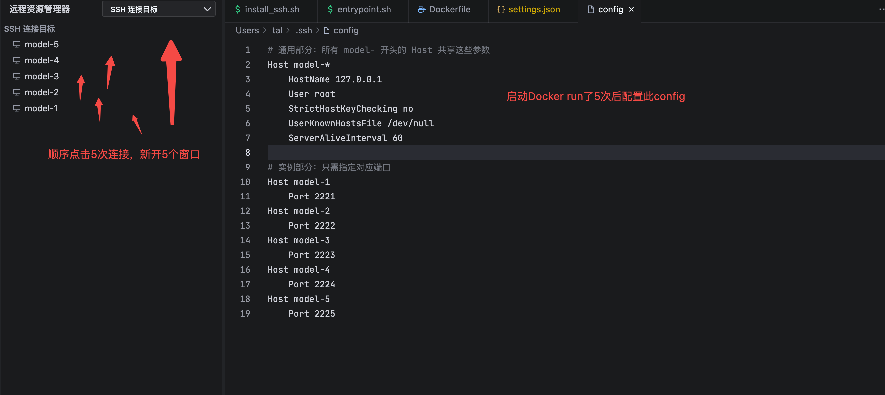
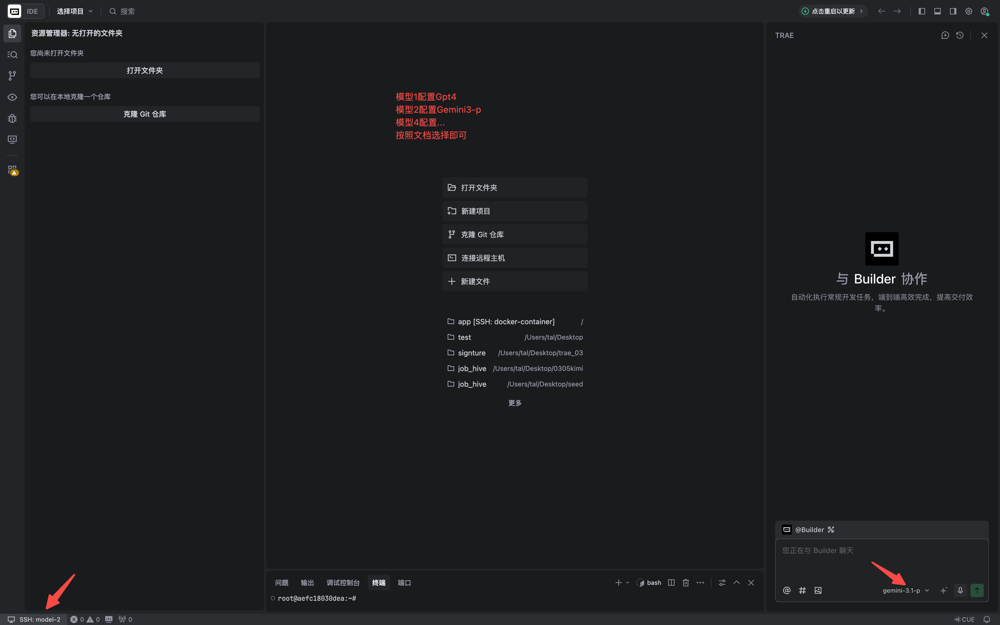

# **🚀 多模型并行 Vibe Coding 教程**

---

## 📋 项目配置概览

本项目已预配置多模型并行环境，以下是完整的配置说明：

### 1. **Build：构建唯一的"母本"镜像**

使用项目预配置的 Dockerfile 构建镜像：

```bash
# 方式1：使用 Makefile（推荐）
make docker-cluster-build

# 方式2：直接使用 Docker
docker build -f environment/Dockerfile -t logsift-trae .
```

> **注意**：Dockerfile 已内置国内镜像源和代理配置：
> - Go 模块代理：`GOPROXY=https://goproxy.cn,direct`
> - Debian 源：`mirrors.tuna.tsinghua.edu.cn`
> - 支持构建时传入代理参数：`docker build --build-arg http_proxy=...`

---

### 2. **Run：启动 5 个"分身"容器**

项目提供三种启动方式：

#### 方式1：使用 Makefile（推荐）
```bash
# 启动集群
make docker-cluster-up

# 停止集群
make docker-cluster-down
```

#### 方式2：使用 Docker Compose
```bash
# 启动集群
docker-compose up -d

# 停止集群
docker-compose down
```

#### 方式3：手动启动
```bash
# 清理旧容器
docker rm -f logsift-cluster-1 logsift-cluster-2 logsift-cluster-3 logsift-cluster-4 logsift-cluster-5

# 启动 5 个容器
docker run -d -p 2221:22 --name logsift-cluster-1 logsift-trae
docker run -d -p 2222:22 --name logsift-cluster-2 logsift-trae
docker run -d -p 2223:22 --name logsift-cluster-3 logsift-trae
docker run -d -p 2224:22 --name logsift-cluster-4 logsift-trae
docker run -d -p 2225:22 --name logsift-cluster-5 logsift-trae
```

> **容器信息**：
> - 容器名：`logsift-cluster-1` 到 `logsift-cluster-5`
> - 端口映射：`2221-2225` → 容器内 `22`
> - SSH 密码：`password`

---

### 3. **配置通用 SSH Config**

编辑本地 `~/.ssh/config`，添加以下配置：

```ssh-config
# 通用配置（所有容器共享）
Host logsift-*
    HostName 127.0.0.1
    User root
    StrictHostKeyChecking no
    UserKnownHostsFile /dev/null
    
    # 连接复用：首个连接建立后，后续连接免密码
    ControlMaster auto
    ControlPath ~/.ssh/master-%r@%h:%p
    ControlPersist 4h
    
    # 心跳保活：防止内网防火墙断开连接
    ServerAliveInterval 30
    ServerAliveCountMax 3

# 各容器端口配置
Host logsift-1
    Port 2221
Host logsift-2
    Port 2222
Host logsift-3
    Port 2223
Host logsift-4
    Port 2224
Host logsift-5
    Port 2225
```

> **连接方式**：`ssh logsift-1`、`ssh logsift-2` 等

---

### 4. **任务流：Git Diff 与环境重置**

每个容器启动时已初始化干净的 Git 仓库，工作流程如下：

#### 查看改动
```bash
# 审查 AI 修改
git diff

# 查看状态
git status
```

#### 重置环境
```bash
# 一键恢复到初始状态（无需重启容器）
git reset --hard HEAD
git clean -fd
```

---

### 5. **并行：新开会话跑下一个 Prompt**

#### 模型轮换策略
每个 Prompt 的第 5 次 rollout 按以下顺序轮换：
1. **MinMax-M2.7**
2. **GLM-5.1**
3. **Qwen3.6-Plus**

#### 操作步骤
1. **新开会话**：在右侧面板新开会话，直接运行下一个 Prompt
2. **切换模型**：在每个窗口的 AI Assistant 面板分别指定模型（GPT-4 或 Gemini 3 Pro）
3. **保持闭环**：所有代码 Diff 审查都在 SSH 环境内完成

---

### 📁 项目配置文件

| 文件 | 说明 |
|------|------|
| `environment/Dockerfile` | 带 SSH 服务的开发镜像 |
| `docker-compose.yml` | Docker Compose 集群配置 |
| `Makefile` | 多容器管理命令 |
| `.trae/ppe_config.yaml` | Trae PPE 配置（含多模型并行设置） |

---

### 🖼️ 示例截图





---

### 💡 使用建议

**资源监控**：同时运行 5 个容器会消耗较多内存，建议在 Docker Desktop 设置中将 Memory 限制上调至 8GB 以上。

**Vibe 节奏**：保持 SSH 连接持续打开，通过 `git reset --hard HEAD` 快速重置环境，最大化迭代效率。

**并行效率**：20 条 Prompt 只需在 5 个窗口中各跑 4 次即可完成 ✅
